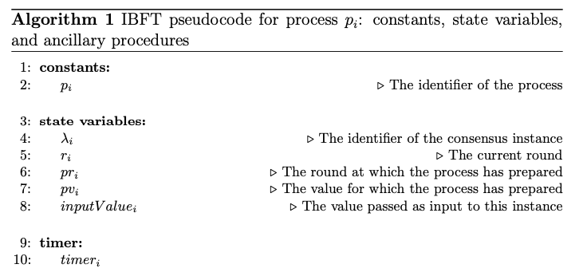

# Instance structure

The paper's algorithm illustrates the protocol rules for one instance of the IBFT, which is identified by $\lambda_1$. 

*Moniz, H. The Istanbul BFT Consensus Algorithm. Algorithm 1. 2020*

An instance of the QBFT is represented by the *Instance* structure. The state variables are stored in the *State* attribute which contains a height and an ID as identifiers, along with the other necessary variables.

## Initialization

*Moniz, H. The Istanbul BFT Consensus Algorithm. Algorithm 1. 2020*

**Pseudo-Code:** When an instance starts, it does the following:
- assigns the identifier,
- sets the round variable to 1,
- sets *prepared_round* and *prepared_value* to empty (or nil),
- assigns the input value variable,
- then, if the leader for round 1 is itself, broadcasts a *Pre-Prepare* with its input value,
- at last, start the timer for the first round.

**Implementation:** The *Instance* class has a *Start* function that does precisely the same as the paper pseudo-code.